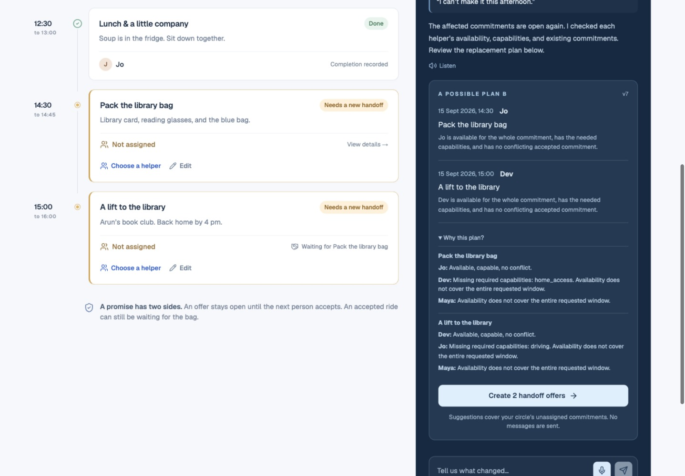

<div align="center">

# KindHandoff
### Care, carried forward.

**One cancellation. Two commitments. A workable afternoon.**

Created by **Shivam Gupta** for the Amazon Developer Hackathon 2026.

[MIT License](LICENSE) · [Watch the 2:49 demo](https://youtu.be/t7e00FzIk2M) · [Architecture](docs/architecture.md) · [Product feedback](docs/product-feedback.md) · [Business case](docs/market-and-business.md)

</div>

KindHandoff helps families repair everyday support plans when someone becomes unavailable. It finds feasible replacements, keeps offers open until the named helpers accept, and shows whether the next step is actually ready.

**Alexa+ primary track:** a working, explicitly labelled browser simulation calling a real **MCP 2025-11-25 server over Streamable HTTP**. No API key or paid model is required. Native Alexa+ deployment is a separate, documented integration step; this submission does not claim it.



[Phone screenshot](docs/screenshots/mobile-390.jpg) · [Tablet screenshot](docs/screenshots/tablet-768.jpg) · [Desktop screenshot](docs/screenshots/desktop.png)

**[Open KindHandoff](https://kindhandoff.web.app)** · Public Firebase app. Try a private fictional demo immediately, or sign in to create your own circle.

## The afternoon that explains the product

Maya cannot make it. Her 14:30 library-bag task and 15:00 ride both need a new handoff. Jo can access the home but cannot drive; Dev can drive but is available only from 14:45. KindHandoff proposes **Jo for the bag, Dev for the ride**. Each person accepts their own offer. The ride stays waiting until the bag is recorded complete.

A calendar can show two names. A workable plan also needs agreement, prerequisites, and a clear record of what changed.

## Try it in five minutes

The hosted app needs no setup. For local development, install Node.js **22.13 or later**, npm and Java **21** for the isolated Firebase emulators. Local tests need no cloud account or secret API key.

```sh
npm ci
npm run build
npx firebase-tools@15.30.1 emulators:exec --only auth,firestore --project demo-kindhandoff "npm run test:firestore && node scripts/verify-local.mjs"
```

For interactive local development, follow the [Firebase setup guide](docs/firebase-deployment.md). Each browser receives its own synthetic household; the Auth emulator provides separate test accounts. The production app uses verified Firebase Authentication.

1. Select **“I can’t make it this afternoon.”** in Maya's demo role.
2. Review the helper, interval, and two affected commitments. Confirm the change.
3. Review the proposed replacement plan and create the two offers.
4. Switch to Jo and accept the bag. Switch to Dev and accept the ride. The pending count only drops after acceptance.
5. Dev's ride is waiting for the bag. As Jo, complete the bag; the ride becomes ready.
6. Open the handoff brief and acknowledge that content version. Add a note to see why a previous acknowledgment becomes out of date.
7. Open **Activity → Live MCP execution trace** to inspect real tool calls. **Settings → MCP** creates a scoped external-client token.

**Prove separate identities:** use **Your circle → Invite** to create Jo and Dev invitation links, then open each in a separate browser profile. Invitations sign in the intended helper once. Helper sessions have no role switch. The included four-session test runs this exact flow without impersonation.

## A usable household workflow

- **Coordinator sign-in:** Firebase email/password sign-up and sign-in; create a blank personal circle.
- **Helpers:** named profiles, capabilities, separate availability windows that preserve gaps, private single-use invitations, and revocation.
- **Commitments:** dated day views, title, practical details, required capabilities, and earlier prerequisites. Edit or cancel open commitments; cancellation retains the original record in the export and activity history. Overnight tasks appear on every day they span.
- **Recovery:** constrained replacement search with visible exclusions; coordinator review before offers.
- **Acceptance:** the proposed helper accepts or declines; every write is authorized and version checked.
- **Handoff brief:** attributed notes, unresolved offers, dependency readiness, acknowledgments of an exact content version.
- **Control:** refresh, activity history, JSON export and confirmed circle deletion. An open form retains its reviewed revision and blocks stale changes after another person edits the circle.
- **Accessibility:** keyboard-operable forms, semantic tabs/dialogs, responsive layouts, reduced motion, typed alternative to microphone input.

The microphone uses the browser's speech recognition service when supported. The transcript is reviewed before sending. The language interpreter supports a defined set of requests; it is not a general-purpose LLM. No audio is stored by the application.

## Technology with a job to do

| Layer | Implementation | Purpose |
|---|---|---|
| Product | React 19, Vite, shared accessible primitives | One coherent coordinator/helper experience |
| MCP | Official TypeScript SDK 1.30; Web Standard Streamable HTTP | Same tools from browser and external MCP clients |
| Rules | TypeScript + Zod; deterministic bounded planner | Explicit constraints and reviewed state changes |
| Persistence | Firestore transactions and version checks | Durable, household-scoped state and safe concurrent edits |
| Login | Firebase Authentication; hashed server sessions and invitations | Persistent coordinator identity and scoped helper access |
| Hosting | Firebase Hosting + Cloud Functions v2 | Public HTTPS, server API and persistent Firestore |

[Architecture and invariants](docs/architecture.md) · [MCP integration guide](integrations/alexa/README.md) · [Security and operating limits](SECURITY.md)

## Verification

```sh
npm run check             # lint, typecheck, unit tests, production build
# With the development server running in another terminal:
npm run test:integration  # actual SDK initialize + tool calls + failure cases
npm run test:e2e          # four independent sessions, invitations and authorization
npm run test:auth         # verified Firebase login, persistence, export and deletion
npm run test:firestore    # isolated concurrency/permission emulator tests
```

Set `BASE_URL` to test a reachable deployment. The authentication proof requires a running Auth emulator, or the explicit `ALLOW_LIVE_AUTH_TEST=1` flag for a new temporary synthetic production account. The workflow tests create fresh synthetic demo households; the auth test creates and cleans up its own fictional account. They never reset a personal circle or print invitation/token secrets.

Recorded evidence is in [docs/evidence](docs/evidence). It includes MCP protocol/transport, separate-session authorization, dependency rejection, retry behavior, stale writes, atomic token rotation, and persisted results. Latencies in local reports are observations from a local test, not production benchmarks.

## Additional open-source contribution

**[@kindhandoff/guard](https://github.com/shi1720/kindhandoff-guard)** is an additional MIT-licensed, dependency-free library for auditable commitment transitions, coverage accounting and candidate ranking. The app imports its vendored source in `packages/handoff-guard`; task dependencies and brief content revisions belong to the application layer. See [contribution notes](docs/open-source-contribution.md).

## Commercial case

Our first audience is a working adult coordinating routine support for a parent with two or more helpers. We plan to test **$12 per household per month, every helper included**. There are no customer, revenue, or time-saving claims. The [business case](docs/market-and-business.md) names competitors, explains the narrow distinction, models costs with explicit assumptions, and defines [customer discovery and pilot stop/go criteria](docs/customer-discovery.md).

## Submission kit

- [Public YouTube demo](https://youtu.be/t7e00FzIk2M) · [Download MP4](docs/deliverables/KindHandoff-Demo.mp4) · [English SRT captions](docs/deliverables/KindHandoff-Captions.srt) · [Thumbnail](docs/deliverables/KindHandoff-Thumbnail.png)
- [Project story](docs/devpost-submission.md) · [All submission fields and testing instructions](docs/submission-fields.md)
- [Copy-ready HTML submission kit](docs/deliverables/KindHandoff-Submission-Kit.html), downloadable for local use
- [Word-for-word English narration and timed recording plan](docs/demo-script.md)
- [Editable pitch deck](docs/deliverables/KindHandoff-Pitch.pptx) · [Pitch PDF](docs/deliverables/KindHandoff-Pitch.pdf)
- [Two-page judge brief](docs/deliverables/KindHandoff-Judge-Brief.pdf)
- [Product feedback and observed friction log](docs/product-feedback.md)
- [Rubric review and changes](docs/rubric-review.md)

The demo uses actual app captures, a fictional household, and clearly disclosed AI-generated narration. The [video source and export checks](docs/video-source/README.md) document its production. The [YouTube video](https://youtu.be/t7e00FzIk2M) is public with uploaded English captions and verified signed-out playback. The [Devpost project](https://devpost.com/software/kindhandoff) exists as a draft and has not been submitted. Current status is tracked in [release status](docs/release-status.md).

All product code and submission materials were created during September 2026 for this entry. Shared framework dependencies and their licenses remain their authors' work. KindHandoff is MIT licensed; attribution to Shivam Gupta appears in the product, repository, and submission materials.

## Current scope

This is a working, tested MVP for practical support, with verified Firebase deployment documented in [release status](docs/release-status.md). It has not undergone a clinical, privacy-compliance, independent security, or production-load certification. It does not monitor emergencies, make medication decisions, infer real-world completion, or automatically send notifications. The pilot must validate household adoption and operational costs before a paid launch.
