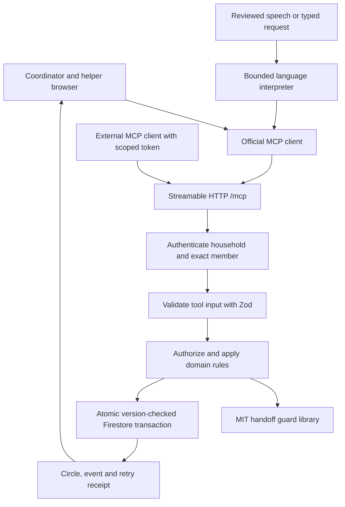

# Architecture

## One set of rules, several entry points

The browser actually initializes an SDK MCP connection and calls tools. There is no parallel fake tool implementation. Administrative HTTP routes handle session creation, invitation redemption, exports, revocation and deletion.

## State and invariants

`open → offered → accepted → done`, with `blocked` representing a disrupted handoff. Declines and reported unavailability reopen work. Only accepted/done commitments count as claimed. Readiness is separately computed from completed prerequisites.

1. A helper's availability never means acceptance.
2. Only the proposed helper can accept their offer. Demo impersonation is available only inside an explicitly isolated, expiring synthetic session.
3. An accepted task cannot complete while a prerequisite is unfinished.
4. Availability changes cannot invalidate an accepted commitment silently; the disruption must be recorded first.
5. Exact actor identity, household membership, capability, window and overlap checks are enforced on the server.
6. Each mutation supplies the latest storage `version` and a UUID `requestId`. A version-checked transaction saves state, event, and retry receipt together. Stale writes fail; identical retries return the current state without repeating the action; reused IDs with different payloads or actors fail.
7. `contentVersion` advances when substantive content changes. Acknowledgments advance storage version for concurrency but do not change the content being read. Two helpers can acknowledge the same brief, while a later note makes that brief stale.
8. Shared notes are untrusted data, never agent instructions. The deterministic interpreter does not execute note text.
9. Corrections and cancellations are limited to open or blocked commitments. Editing checks earlier dependencies and downstream timing; cancellation rejects any active dependency and preserves a full cancelled record. Neither action rewrites accepted, offered, or completed handoff evidence.

## Corrections and availability contracts

Every mutating tool still requires the current `expectedVersion` and a unique UUID `requestId`.

- `edit_commitment` takes `taskId`, `title`, `details`, UTC `start`/`end`, `requiredCapabilities`, and `dependsOn`. Only the coordinator can edit an open or blocked task. Self-dependencies and overlapping dependency timing are rejected. The task revision and circle content revision advance, and any cached recovery plan is cleared.
- `cancel_commitment` takes `taskId`. Only open or blocked tasks with no active dependents can be cancelled. The task leaves the active schedule; `circle.archivedTasks` retains `{task, cancelledAt, cancelledBy}` and is included in the coordinator's export. A cancellation is distinct from completion. There is no general archive/delete operation for completed commitments.
- `set_availability` accepts either `availability: [{start, end}]` or the legacy single `start`/`end` pair, never both. Up to eight nonoverlapping UTC windows are accepted, including an empty list when no windows are available. Every interval is at most 24 hours. Gaps remain unavailable, and accepted commitments must remain feasible after the change. The helper may update their own profile; the coordinator may update any helper.

Cancellation records are capped at 100 alongside the existing 100 active-task limit and 400 KB total payload bound. Reaching a bound returns a clear error instead of silently removing history. Exporting does not reset a storage limit; starting a replacement personal circle requires deleting the previous circle after exporting it.

## Replacement planning

Candidate assessment checks explicit capabilities, availability, existing accepted work, and offered/selected work in the proposed plan. Most-constrained tasks are considered first so a flexible job does not consume the only driver. Bounded backtracking searches at most 4,096 nodes, eight open tasks and sixteen helpers; the UI discloses the limit and unresolved commitments. The plan is a suggestion, recomputed and version checked when the coordinator confirms it.

Dependencies determine task readiness. The plan does not infer travel duration, location, clinical suitability, or unrecorded availability. Those would require new validated inputs.

## Persistence and identity

Firestore collections contain circles, owners, hashed sessions, hashed invitations and a demo-admission control document. One bounded JSON payload per household keeps a state transition and its short event history atomic. A transaction on the owner mapping prevents duplicate personal circles. Browser database rules deny all direct reads/writes; only the server Admin SDK can access storage. The runtime service account has `datastore.user` and `firebaseauth.viewer`, rather than project-wide editor access.

Firebase Authentication verifies coordinator sign-in. A recent, verified ID token is exchanged for a random, hashed server session; caller identity headers are discarded. A coordinator can sign in before creating a circle, and returning sign-in finds the same persisted circle. The browser Firebase SDK uses in-memory persistence, then signs out of client state after exchanging its token. Production uses the attached GCP service account; no service-account key file is deployed.

The cookie is named `__session`, which Firebase Hosting forwards to Cloud Functions. It is HttpOnly, SameSite=Lax and Secure on HTTPS. A coordinator session lasts 24 hours. One-time helper invitations place a 256-bit token in a URL fragment and remove it on page load. Redemption is transactional. Helper sessions last up to seven days, limited by the lifetime of a demo circle.

Each member has an access epoch, and the circle records the current MCP token hash. Revocation/rotation changes these markers transactionally. Every tool first reads the circle and its authorization in one transaction, including read-only tools and idempotent replay responses. The final mutation transaction checks authorization again. A principal captured before revocation cannot subsequently read a newer circle or commit a write. Session and export routes also use the authorized read. MCP tokens last up to 24 hours and only work as Bearer credentials on `/mcp`; they cannot administer accounts or invitations.

Cookie-derived session reissuance transactionally reads and consumes the original session. Logout and competing reissues cannot leave a revived owner cookie: only one reissue can consume a live parent. Fresh authentication through a recently verified Firebase ID token is a separate authorization path.

Firestore TTL is enabled for `expiresAt` on circles, invitations and sessions. Expiration is also enforced in application authorization immediately; security never depends on eventual TTL deletion. Deleting a circle immediately removes its content and owner mapping. Outstanding token/invitation metadata becomes unusable because its circle is missing, then TTL reclaims it.

## Efficiency and operating bounds

No LLM request is required for deterministic planning or the simulator. One persistent document avoids a series of partially completed database writes. The browser refreshes a visible circle every 12 seconds and when focus/visibility returns; hidden tabs do not poll. A manual refresh is always available. Limits: 100 commitments, 16 members, 100 notes, 250 activity events, 100 retry receipts and a 400 KB serialized household. Demo admission is globally bounded to 120 new circles per hour and 500 active circles, with 24-hour expiry; reset reuses the existing demo row. These conservative bounds suit a hackathon/pilot and require measured revision for broader launch.

Application state has bounded retention; the activity view is not a permanent, tamper-proof compliance audit. No automatic helper notifications, push, SMS, billing, clinical logic, or background emergency escalation is implemented. Firebase sends account-recovery email only when a person explicitly requests it.

An owner refresh currently performs six Firestore document reads, including the final transactional session/circle check. This is a code-derived budgeting count, not measured telemetry; transaction retries can add reads. The stronger revocation guarantee adds a read compared with the earlier nontransactional refresh. See [security semantics](security.md) and the [deployment procedure](firebase-deployment.md).
